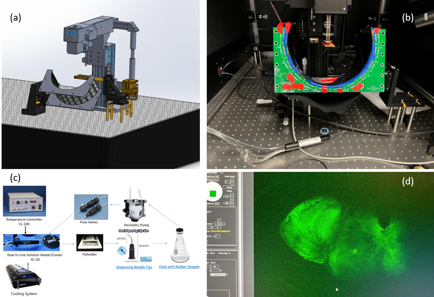

Supervisor: Professor [Jean-Michel Mongeau](https://sites.psu.edu/mongeau/PIbio/) 

As a graduate student in the laboratory, I have participated in research focused on recording the activities of neurons in flies in order to understand the connection between neuron control and bio-motion. I was trained to tether fruit flies to the fly holder without causing any injury. Taking on a leading role in the experimental setup, I constructed the fly holder according to the [previous design](https://ptweir.github.io/flyHolder/#finished) and created a mounting system with adjustable angles for the semicylinder LED arena. Additionally, I developed a temperature control saline system for the fly holder in the two-photon microscopy area. Furthermore, I received training in aligning the [Sapphire Femtosecond Laser for Two-Photon Microscopy](https://www.thorlabs.com/newgrouppage9.cfm?objectgroup_id=8323).  

During this research, I carried out the following tasks:  
* Learned to tether fruit flies to the static and flying fly holders.
* Learned and documented the fruit flies' head dissection to explore the brain under the 2-photon microscopy.
* Constructed the flying fly holders and the brass tube holder in the anesthesia system in the [learning factory](https://www.lf.psu.edu/).
* Designed and developed a versatile angle-adjustable mounting system for the arena and fly holder. Constructed the bill of material (BOM) and successfully assembled all the components.
* Designed and developed a temperature control saline system for the fly holder. Constructed the bill of material (BOM) and successfully assembled all the components.
* Received training in aligning the laser.
* Imaged the calcium activity in neurons of flies in 2-photon microscopy.

  

<i>(a) The 2-photon experiment setup in SolidWorks. (b) The real setup. Changed the fly holder mounting stage to the left side for a better user experience when finding the head under microscopy. (c) Saline system for the fly holder to maintain the temperature of the brain. (d) Calcium imaging of flies.</i>

<video width="320" height="240" controls>
  <source src="../images/Tehtered Fly Flying.mp4" type="video/mp4">
  Your browser does not support the video tag.
</video>
