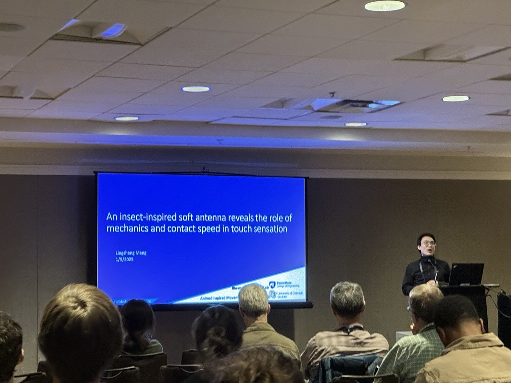

I presented a talk today at SICB (Society for Integrative and Comparative Biology) 2025 in Atlanta, GA, as part of the Division of Comparative Biomechanics' Best Student Presentation session.  

My talk, titled "An Insect-Inspired Soft Antenna Reveals the Role of Mechanics and Contact Speed in Touch Sensation", explored how mechanics of antenna decomposes tactile features into a lexicon of motifs. 

Also, the Atlanta Marriott Marquis, the conference hotel, is so cool! I love the center elevator and the Hub at Peachtree Center—such a great space to explore.  

Presentation

