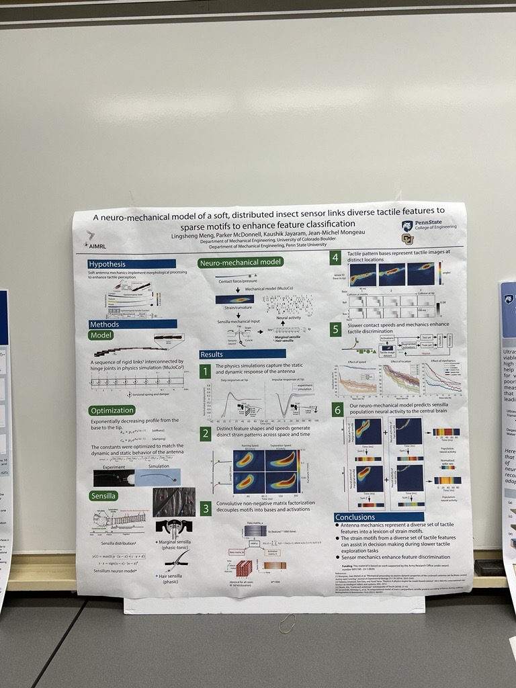

---
title: "A neuro-mechanical model of a soft, distributed insect sensor links diverse tactile features to sparse motifs to enhance feature classification "
collection: publications
excerpt: ''
permalink: /publications/CNE_2024
date: 2024-8-19
venue: 'Center for Neural Engineering 2024 Retreat, State College, 2024'
type: 'Conference'
---

This poster is about developing a neuro-mechanical model of a soft, distributed insect sensor.

My poster for CNE

