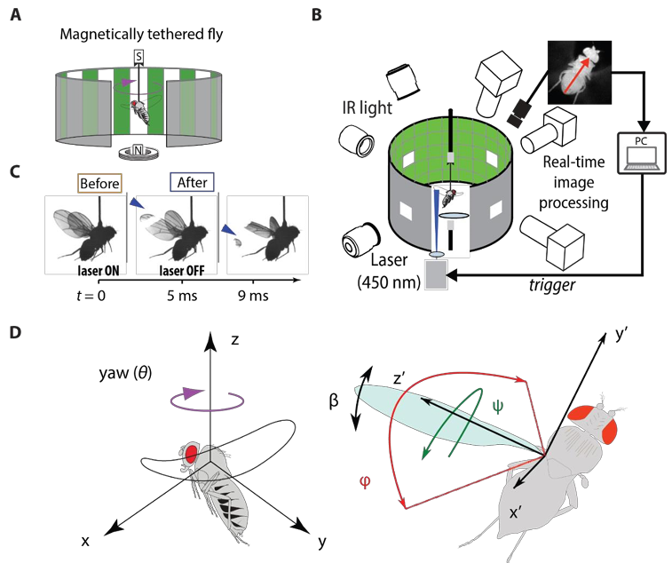

Supervisor: Professor [Jean-Michel Mongeau](https://sites.psu.edu/mongeau/PIbio/) 

## Fly Behavior Analysis for Wing Damage Compensation during Flight

As a new PhD student in the Mongeau Lab, I learned to operate the **3D wing motion recording system** with laser-triggered capture and gained experience in using **custom software for 3D reconstruction of wing kinematics**. I assisted senior PhD student Dr. [Wael Salem](https://www.linkedin.com/in/wael-salem/) with experiments and data analysis, contributing to his [dissertation](https://etda.libraries.psu.edu/catalog/19881was29) on insect flight biomechanics.  

---

### 🔹 Research Focus
- Investigated how **wing damage affects flight control** in tethered flies.  
- Analyzed **wingbeat frequency changes** following mechanical perturbations.  
- Assisted in uncovering compensatory mechanisms underlying stable flight despite wing asymmetry.  

  
   
  <i>project overview</i>

---

### 🔹 Key Contributions
- Acquired and analyzed **11 experimental datasets** on wing damage during flight.  
- Performed **3D flight behavior reconstruction** for 16 flies using custom reconstruction software from high-speed videos (8000fps).  
- Derived **wing Euler angles** from 3D flight reconstruction to quantify wing kinematics.  
- Contributed data and analysis to support Dr. [Wael Salem](https://www.linkedin.com/in/wael-salem/) in his [PhD dissertation](https://etda.libraries.psu.edu/catalog/19881was29).  

---

### 🔹 Skills & Tools
- **Experimental analysis**: experiment on fruit flies, behavioral assays, perturbation experiments.
- **Camera calibration**: [*easywand*](https://biomech.web.unc.edu/wand-calibration-tools/) for camera calibration to obtain DLT parameters.
- **3D reconstruction**: custom software for motion capture and reconstruction.  

**Software Used:**  
- *MATLAB* – control high-speed cameras and the triggered laser, data processing, signal analysis, and kinematic calculations
- [*DLTdv*](https://biomech.web.unc.edu/dltdv/) - MATLAB tools for digitizing video files and calibrating cameras

---
